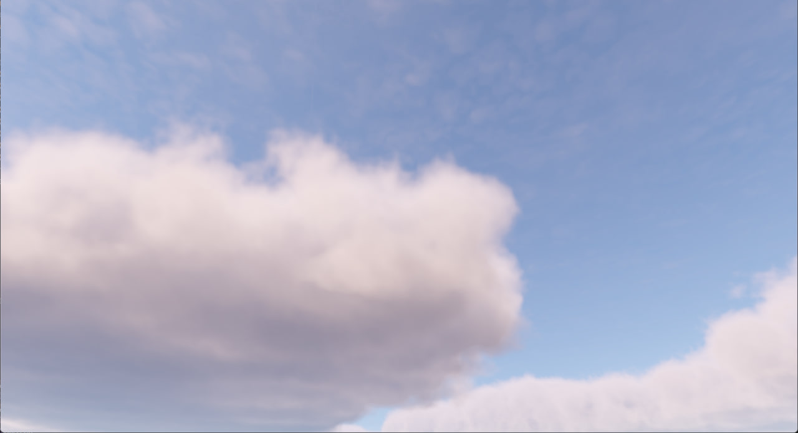

# SkyGL

 

Project written with OpenGL focused on creating and exploring in-game sky including weather, clouds and atmosphere
rendering.



## Build & Run
### Requirements

- CMake 4.0+
- C++20
- OpenGL >= 4.5
- GLM, ImGui, GLFW3, GLAD, STB

```bash
git clone https://github.com/kotivas/skygl.git
cd skygl
cmake -B build
cmake --build build
```

Copy the `res` folder next to the executable, then run it

## Planned

- [ ] Procedural weather system
- [ ] Volumetric cloud optimization
- [ ] Night sky
- [ ] Simplify bruneton atmosphere model?

## References

- Bruneton, E. (2017) — Precomputed Atmospheric Scattering: a New Implementation
  https://ebruneton.github.io/precomputed_atmospheric_scattering/

- Guerrilla Games (2015) — The Real-Time Volumetric Cloudscapes of Horizon Zero Dawn
  https://www.guerrilla-games.com/read/the-real-time-volumetric-cloudscapes-of-horizon-zero-dawn

- SimonDev (2022) — How Big Budget AAA Games Render Clouds
  https://youtu.be/Qj_tK_mdRcA?si=YALyvCXU96xTZG0H
